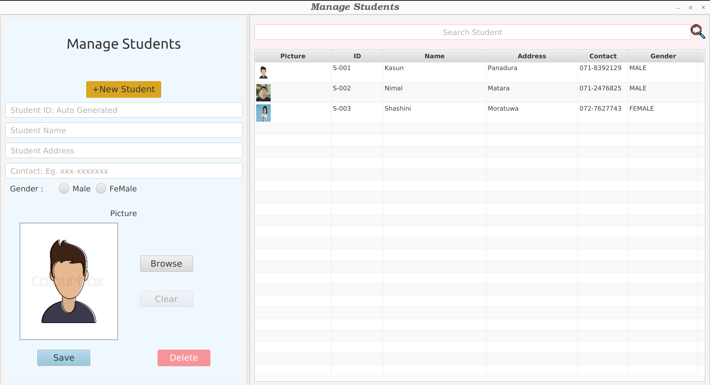
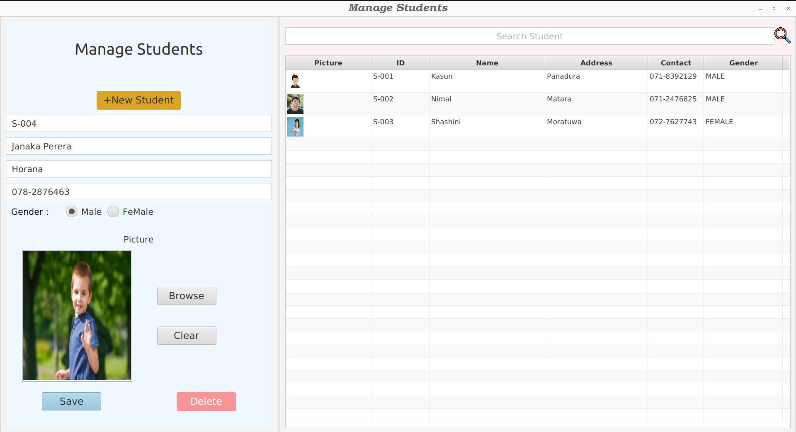
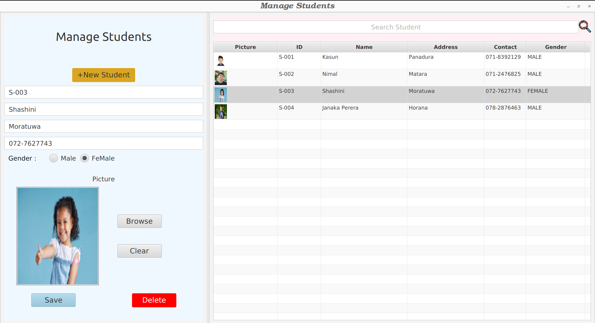
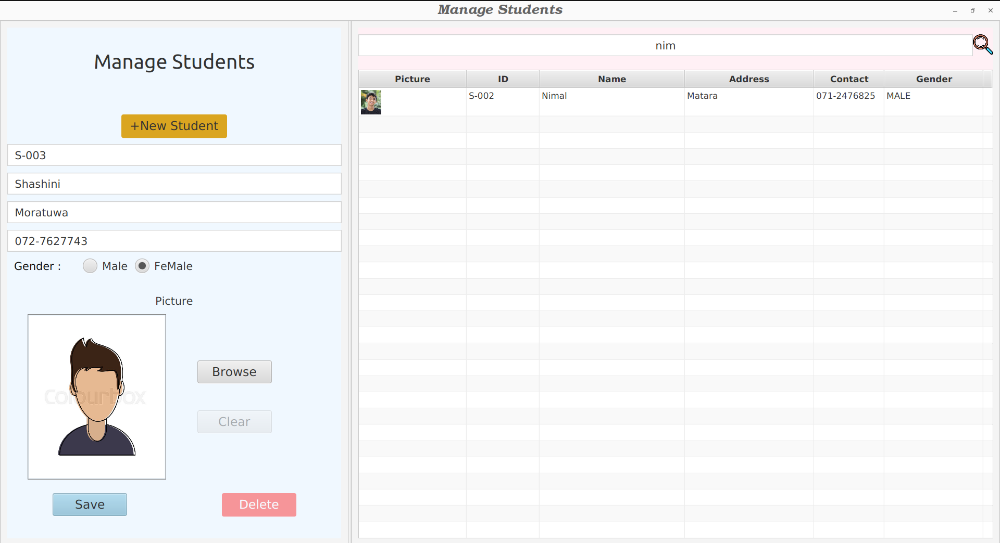

# Student-Management-System

The Student Management System is a desktop application designed to facilitate the management of student information. It has been developed using several technologies, including Java SE, JavaFX, and JDBC.

The system offers a range of services to effectively handle student data. It provides a user-friendly interface where administrators or authorized personnel can save, update, and delete student records. With its intuitive design, the application aims to streamline administrative tasks and enhance the efficiency of student management processes.

## Technologies and Tools Used

- Java 11
- Java SE 11
- JavaFX
- JDBC
- MySQL

## Features

- Save, update and delete student records.

## Getting Started

To get started with the Student Management System application, follow these steps:

1. Clone the repository: `git clone https://github.com/KasunChathuranga3732/student-management-system.git`
2. Set up the necessary configurations.
3. Install the required dependencies and libraries.
4. Build and run the application.

## License

Copyright &copy; 2023. All Rights Reserved.

## Contact

For any inquiries or support, please contact [Kasun Chathuranga](mailto:kasunchathuranga3732@gmail.com).

## Screen Shots
### UI

### Save Student

### Select Student

### Search Students

